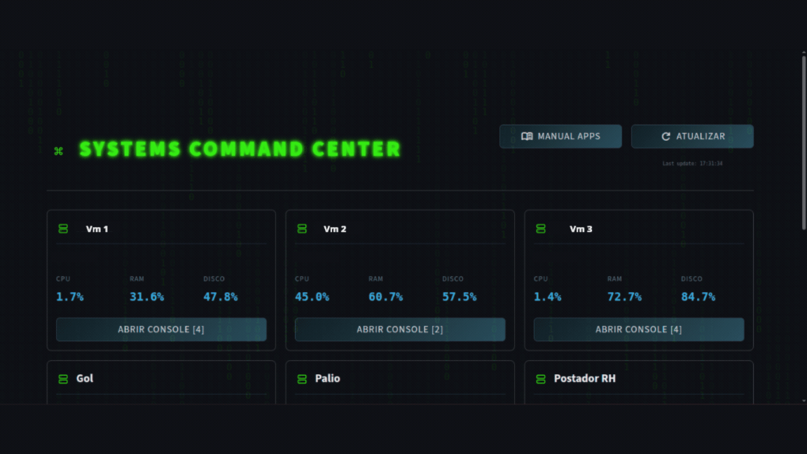

# 🛰️ Systems Command Center


Um dashboard interativo e em tempo real construído com **Streamlit** para monitoramento global de infraestrutura (VMs Windows) e status de robôs de automação (RPA/APIs). O projeto apresenta uma interface visual imersiva estilo "Cyberpunk/Matrix" com feedback dinâmico de hardware e software.

## ✨ Funcionalidades

* **Monitoramento de Hardware em Tempo Real:** Integração direta com o Prometheus via PromQL para extrair dados de uso de CPU, RAM e Disco (C:) dos servidores (via Node Exporter).
* **Console de Operações de RPA:** Leitura de endpoints JSON para verificar o status de robôs de automação (ex: Apuração de Domínio, Disparo de E-mails de Cobrança).
* **Base de Conhecimento e Troubleshooting:** Central de manuais integrada com protocolos de inicialização (START) e guias de resolução de erros específicos para cada automação, persistidos em banco de dados para garantir rápida resposta a incidentes.
* **UI/UX Avançada (Vibe Tech):** * Fundo animado em JavaScript nativo (Matrix Digital Rain) isolado para não interferir na performance.
    * CSS customizado com grid responsivo, cores elétricas de status (Neon Green, Amber, Electric Red) e fontes monospace (`Fira Code`).
    * Modais modulares expandidos construídos com Flexbox.
* **Arquitetura Segura:** Separação estrita de responsabilidades (UI x Lógica de Rede) e proteção de dados sensíveis da infraestrutura interna.


## 🎬 Demonstração




## 🛠️ Tecnologias Utilizadas

* **Linguagem:** Python
* **Frontend:** Streamlit, HTML5, CSS3, JavaScript (Canvas API)
* **Integrações:** Requests (APIs REST), Prometheus
* **Dados:** Pandas, Datetime

## 🚀 Como Executar o Projeto

**1. Clone o repositório**
```bash
git clone [https://github.com/seu-usuario/systems-command-center.git](https://github.com/seu-usuario/systems-command-center.git)
cd systems-command-center
```

**2. Instale as dependências**
```bash
pip install -r requirements.txt
```

### **3. Configure o Ambiente**
Para garantir a segurança da infraestrutura, os arquivos de configuração reais são ignorados pelo Git. O repositório fornece templates que já contêm toda a **lógica de comunicação com o Prometheus** e o **esquema de dados** esperado pelo dashboard.

* Renomeie o arquivo `config_vms.exemplo.py` para `config_vms.py`.
* Renomeie o arquivo `nomes_vm.exemplo.py` para `nomes_vm.py`.
* Edite o `config_vms.py` inserindo os IPs reais dos seus servidores e os endpoints das suas automações no dicionário `VMS`.

---

### **4. Execute o Dashboard**
```bash
streamlit run app.py
```

## 📂 Estrutura do Projeto

```text
├── app.py                   # UI Streamlit, Injeção de CSS/JS e lógica de modais
├── config_vms.exemplo.py    # Motor de integração (Prometheus API) e schema do dicionário VMS
├── nomes_vm.exemplo.py      # Template para mapeamento de IPs e labels das máquinas
├── knowledge_base.db        # Banco SQLite que persiste os manuais e protocolos de erro
├── requirements.txt         # Dependências do projeto (Pandas, Requests, Streamlit)
└── README.md                # Documentação do sistema
```
